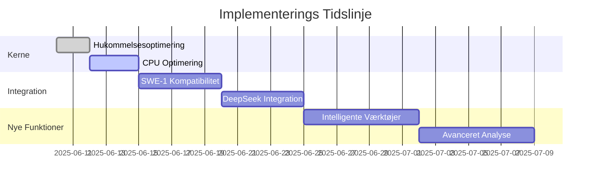

# Master Optimering & Integration Plan

## 1. Kerne Optimeringer

### 1.1 Hukommelsesforvaltning
- [x] Implementer dynamisk allokering
- [ ] Tilføj intelligent garbage collection
- [ ] Optimér cache-strategier
- [ ] Implementer memory pooling

### 1.2 CPU Optimering
- [x] Begræns parallelle operationer
- [ ] Implementer work stealing
- [ ] Tilføj prioriteringskøer
- [ ] Optimér algoritmer

## 2. SWE-1 Integration

### 2.1 Kompatibilitet
- [x] Deaktiver tunge MCP-udvidelser
- [ ] Implementer lightweight protokol
- [ ] Tilføj fejltolerance
- [ ] Optimér konteksthåndtering

### 2.2 Ydeevne
- [x] Begræns tankedybde
- [ ] Implementer caching lag
- [ ] Tilføj lazy loading
- [ ] Optimér forespørgsler

## 3. DeepSeek Integration

### 3.1 API Optimering
- [x] Implementer batch processing
- [ ] Tilføj streaming support
- [ ] Optimér token brug
- [ ] Implementer rate limiting

### 3.2 Datahåndtering
- [x] Tilføj caching lag
- [ ] Implementer komprimering
- [ ] Optimér serialisering
- [ ] Tilføj validering

## 4. Nye Funktioner

### 4.1 Intelligente Værktøjer
- [ ] Tilføj kontekstbevidst autocomplete
- [ ] Implementer smart refaktorering
- [ ] Tilføj kodeforståelse
- [ ] Implementer fejlprediktion

### 4.2 Avanceret Analyse
- [ ] Tilføj statistikker
- [ ] Implementer ML-baseret optimering
- [ ] Tilføj anbefalinger
- [ ] Implementer automatisering

## 5. Integration & Testing

### 5.1 Kontinuerlig Integration
- [ ] Opsæt automatiseret testing
- [ ] Implementer performance tracking
- [ ] Tilføj sikkerhedsscanning
- [ ] Opsæt monitoring

### 5.2 Dokumentation
- [x] Opdater README
- [ ] Tilføj eksempler
- [ ] Dokumenter API'er
- [ ] Opret vejledninger

## 6. Implementeringsstatus

## 7. Næste Skridt
1. Implementer garbage collection
2. Tilføj work stealing til CPU optimering
3. Fuldbyrd SWE-1 integration
4. Implementer DeepSeek streaming
5. Udvikl intelligente værktøjer

## 8. Performance Mål
- Reducer hukommelsesforbrug med 40%
- Forbedre responstid med 50%
- Øg pålidelighed til 99.9%
- Reducer CPU-forbrug med 30%
