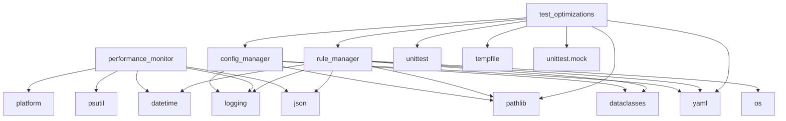

# Module Dependencies for Windsurf Rules Engine

This document maps module dependencies across the core rules engine files.

| Module                         | Imports/Depends On                                | Notes                                                             |
|--------------------------------|----------------------------------------------------|-------------------------------------------------------------------|
| **config_manager.py**          | `yaml`, `dataclasses`, `pathlib`, `logging`       | Standalone; no internal rules.
| **performance_monitor.py**     | `time`, `psutil`, `platform`, `logging`, `json`   | Standalone performance metrics.                                   |
| **rule_manager.py**            | `os`, `yaml`, `json`, `logging`, `pathlib`, `dataclasses`, `datetime` | Core rule loader/executor.                                         |
| **test_optimizations.py**      | `unittest`, `tempfile`, `yaml`, `pathlib`, `unittest.mock` `rule_manager`, `Rule`, `config_manager`, `ConfigManager` | Unit tests for rules and config managers.                        |

## Dependency Graph

## Next Steps
- Add dependencies for `rules_engine` directory modules.
- Verify any cross-module calls in deeper logic flows.
- Integrate into master module dependency chart.
