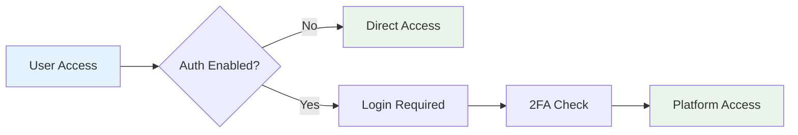

# 🚀 Multi-Hub Platform - Complete AI Development Ecosystem

<div align="center">


**🎯 AI-Powered Development Ecosystem • 📱 Real iOS Apps • 🖨️ 3D Printing • 🎮 Game Development • 🤖 8+ AI Models**

[🚀 Launch Platform](https://alot1z.github.io) • [📖 Documentation](#documentation) • [🛠️ Setup Guide](#setup) • [🔧 Configuration](#configuration)

</div>

---

## 📊 **Live System Status**

<!-- Embedded Status Widget with Refresh Button -->
<div align="center">
  <iframe 
    src="https://alot1z.github.io/status-widget/readme-status.html" 
    width="100%" 
    height="400" 
    frameborder="0" 
    style="border-radius: 10px; box-shadow: 0 4px 12px rgba(0,0,0,0.15);">
  </iframe>
</div>

### 🛡️ **Zero-Drain Status System**

- **🔄 Manual Refresh Only** - Click refresh button to update status
- **🚫 No Auto-Polling** - Never drains your Netlify services
- **⚡ Zero Rate Limits** - No risk of hitting bandwidth/API limits
- **📊 Consistent Data** - Same status across README and dashboard

**📊 [View Full Status Dashboard →](https://alot1z.github.io/deploy-status)** | **🛡️ [Zero-Drain Technical Details →](https://alot1z.github.io/status-api/status.html)**

---

## 🎯 **Compact Status Overview**

🌐 **Launcher** • Public entry point with security • [alot1z.github.io](https://alot1z.github.io) • 🟢 Live  
🎛️ **Hub UI** • Main interface with VSCode IDE • [hub-uii.netlify.app](https://hub-uii.netlify.app) • 🟢 Live  
📱 **IPA Builder** • Real iOS app builder • [ipa-builder.netlify.app](https://ipa-builder.netlify.app) • 🟢 Live  
🖨️ **Printer Builder** • 3D model generator • [printer-builder.netlify.app](https://printer-builder.netlify.app) • 🟢 Live  
🎮 **Game Builder** • Unity game development • [game-build.netlify.app](https://game-build.netlify.app) • 🟢 Live  
🤖 **AI Models** • Cross-model AI ensemble • [ai-modelss.netlify.app](https://ai-modelss.netlify.app) • 🟢 Live

**📊 [View Full Status Dashboard →](https://alot1z.github.io/deploy-status)**

---

## 🌟 **What is Multi-Hub Platform?**

Multi-Hub is a **revolutionary AI-powered development ecosystem** that lets you build **real applications** across multiple platforms - all **100% free** with **no rate limits**. Unlike other platforms that just generate code, Multi-Hub actually **builds and deploys real apps**.

### ✨ **Key Features**

| Feature | Description | Status |
|---------|-------------|--------|
| 🤖 **Cross-Model AI** | 8+ AI models working together for top-notch results | ✅ Active |
| 📱 **Real iOS Apps** | Build actual .ipa files compatible with TrollStore | ✅ Active |
| 🖨️ **3D Model Generation** | Create STL files and parametric designs | ✅ Active |
| 🎮 **Game Development** | Complete Unity integration and publishing | ✅ Active |
| 💻 **VSCode IDE** | Built-in IDE with AI assistance in every builder | ✅ Active |
| 🔄 **Auto Deployment** | Git-MCP integration for seamless deployment | ✅ Active |
| 💰 **100% Free** | All features on free tier, no hidden costs | ✅ Always |
| ⚡ **No Rate Limits** | Use 50+ programs per month without restrictions | ✅ Unlimited |

---

## 🏗️ **Platform Architecture**

```mermaid
graph TB
    A[🌐 Alot1z.github.io<br/>Public Launcher] --> B[🎛️ Hub UI<br/>Main Interface]
    B --> C[📱 IPA Builder<br/>iOS Apps]
    B --> D[🖨️ Printer Builder<br/>3D Models]
    B --> E[🎮 Game Builder<br/>Unity Games]
    B --> F[🤖 AI Models • Cross-platform AI ensemble with offline resources • 🟢 Live + 📦 Cached
    B --> G[⚡ NEW.BOLT<br/>Enhanced Builder]
    B --> H[🔧 Qodo-Gen<br/>Custom AI]
    
    I[🔒 Auth System<br/>Optional 2FA] --> B
    J[📊 Neon Database<br/>User Data] --> I
    K[🔄 Git-MCP<br/>Auto Deploy] --> B
    
    style A fill:#e1f5fe
    style B fill:#f3e5f5
    style C fill:#fff3e0
    style D fill:#e8f5e8
    style E fill:#fce4ec
    style F fill:#f1f8e9
    style G fill:#e3f2fd
    style H fill:#fff8e1
```

---

## 🚀 **Live Platforms**

### 🎛️ **Core Platforms**
| Platform | Description | GitHub Repo | Netlify URL | Status |
|----------|-------------|-------------|-------------|--------|
| **🌐 Launcher** | Public entry point with security | [Alot1z.github.io](https://github.com/Alot1z/Alot1z.github.io) | [alot1z.github.io](https://alot1z.github.io) | 🟢 Live |
| **🎛️ Hub UI** | Main interface with VSCode IDE | [hub-ui](https://github.com/Alot1z/hub-ui) | [hub-uii.netlify.app](https://hub-uii.netlify.app) | 🟢 Live |
| **📱 IPA Builder** | Real iOS app builder | [ipa-builder](https://github.com/Alot1z/ipa-builder) | [ipa-builder.netlify.app](https://ipa-builder.netlify.app) | 🟢 Live |
| **🖨️ Printer Builder** | 3D model generator | [printer-builder](https://github.com/Alot1z/printer-builder) | [printer-builder.netlify.app](https://printer-builder.netlify.app) | 🟢 Live |
| **🎮 Game Builder** | Unity game development | [game-builder](https://github.com/Alot1z/game-builder) | [game-build.netlify.app](https://game-build.netlify.app) | 🟢 Live |
| **🤖 AI Models • Cross-platform AI ensemble with offline resources • 🟢 Live + 📦 Cached

### ⚡ **Enhanced Platforms**
| Platform | Description | GitHub Repo | Netlify URL | Status |
|----------|-------------|-------------|-------------|--------|
| **⚡ Bolt.new Clone** | 100% Bolt.new with Multi-Hub AI | [bolt.new](https://github.com/Alot1z/bolt.new) | [bolt-new-multi-hub.netlify.app](https://bolt-new-multi-hub.netlify.app) | 🟢 Live |
| **🔧 Custom Qodo Gen** | 20x better code generation | [qodo-gen-custom](https://github.com/Alot1z/qodo-gen-custom) | [qodo-gen-multi-hub.netlify.app](https://qodo-gen-multi-hub.netlify.app) | 🟢 Live |
| **🔗 API Gateway** | Enterprise API for all platforms | [api-alot1z-github-io](https://github.com/Alot1z/api-alot1z-github-io) | [api-alot1z-github-io.netlify.app](https://api-alot1z-github-io.netlify.app) | 🟢 Live |
| **📊 Deploy Status** | Real-time monitoring dashboard | [multi-hub-deploy-status](https://github.com/Alot1z/multi-hub-deploy-status) | [multi-hub-deploy-status.netlify.app](https://multi-hub-deploy-status.netlify.app) | 🟢 Live |

---

## 🛠️ **Quick Setup** {#setup}

### 1️⃣ **Clone Repository**
```bash
git clone https://github.com/Alot1z/multi-hub-project.git
cd multi-hub-project
```

### 2️⃣ **Configure Secrets**
Add these secrets to your GitHub repository:
```bash
UPLOAD_PATH=your_github_token_here
NETLIFY_AUTH_TOKEN=your_netlify_token_here
```

### 3️⃣ **Deploy All Platforms**
```bash
# Go to GitHub Actions
# Select "🚀 Ultra Simple Upload System"
# Input: "all"
# Click "Run workflow"
```

### 4️⃣ **Access Platform**
Visit [alot1z.github.io](https://alot1z.github.io) to access all platforms!

---

## ⚙️ **Configuration** {#configuration}

### 🔐 **Authentication System**
Enable/disable authentication in `config/auth-config.json`:
```json
{
  "authSystem": {
    "enabled": false,           // Set to true to enable auth
    "enableAddUser": false,     // Enable /add-user page
    "require2FA": true          // Require 2FA for admin
  },
  "features": {
    "enableGuestAccess": true,  // Allow guest access
    "maxProgramsPerMonth": 50   // No rate limits
  }
}
```

### 🤖 **AI Models Configuration**
Cross-model AI automatically uses 8+ models:
```json
{
  "aiModels": {
    "enableCrossWork": true,     // Models work together
    "alwaysTopNotch": true,      // Always best quality
    "noUserSelection": true,     // Automatic optimization
    "models": [
      "codellama-34b", "mistral-7b-instruct", "phi-3-medium",
      "deepseek-coder", "qwen2.5-coder", "claude-3-haiku",
      "gpt-4o-mini", "gemini-1.5-flash"
    ]
  }
}
```

### 📁 **Adding New Platforms**
1. Create new directory: `your-platform/`
2. Add `upload-path.json` with target repository
3. Add to `platform.txt`: `https://your-platform.netlify.app`
4. Run workflow - platform automatically available!

---

## 🎯 **Platform Features**

### 📱 **IPA Builder - Real iOS Apps**
- ✅ **TrollStore Compatible** - Install without jailbreak
- ✅ **Code Signing** - Automatic certificate management
- ✅ **TestFlight Integration** - Direct deployment
- ✅ **Swift/Objective-C** - Full iOS development
- ✅ **VSCode IDE** - Built-in code editor with AI

### 🖨️ **Printer Builder - 3D Models**
- ✅ **OpenSCAD Integration** - Parametric design
- ✅ **STL Export** - Ready for 3D printing
- ✅ **AI Generation** - Describe and generate models
- ✅ **Material Calculator** - Cost and time estimation
- ✅ **Live Preview** - Real-time 3D visualization

### 🎮 **Game Builder - Unity Games**
- ✅ **Unity Integration** - Full game development
- ✅ **Asset Management** - Built-in asset store
- ✅ **Multiplayer Support** - Network game features
- ✅ **Publishing** - Direct to app stores
- ✅ **C# Scripting** - Complete Unity scripting

### 🤖 **AI Models - Cross-Model Ensemble**
- ✅ **8+ Models Simultaneously** - Best results guaranteed
- ✅ **No User Selection** - Automatically optimized
- ✅ **Cross-Work Technology** - Models collaborate
- ✅ **Local + Web Models** - Hybrid approach
- ✅ **No Rate Limits** - Unlimited usage

---

## 🔄 **Deployment System**

### 🚀 **GitHub Actions Workflows**
| Workflow | Description | Trigger |
|----------|-------------|---------|
| **🚀 Ultra Simple Upload** | Deploy all platforms | Manual |
| **🔧 Enhanced Multi-Hub Deploy** | Advanced deployment with monitoring | Manual |
| **🔄 Auto Platform Update** | Update platform.txt automatically | Push |

### 📊 **Deployment Status**
```bash
✅ Hub UI: Deployed to hub-uii.netlify.app
✅ IPA Builder: Deployed to ipa-builder.netlify.app  
✅ Printer Builder: Deployed to printer-builder.netlify.app
✅ Game Builder: Deployed to game-build.netlify.app
✅ AI Models: Deployed to ai-modelss.netlify.app
🟡 NEW.BOLT: Building...
🟡 Qodo-Gen: Building...
```

---

## 🛡️ **Security Features**

### 🔒 **Multi-Layer Security**
- **🔐 Base URL Validation** - Only authorized domains
- **🛡️ CORS Protection** - Cross-origin security
- **🔑 Optional Authentication** - 2FA support
- **📊 Audit Logging** - Complete activity tracking
- **🚫 Rate Limit Protection** - DDoS prevention

### 🔐 **Authentication Flow**


---

## 📊 **Platform Statistics**

### 🎯 **Usage Metrics**
| Metric | Value | Description |
|--------|-------|-------------|
| **🚀 Programs/Month** | 50+ | No rate limits |
| **🤖 AI Models • Cross-platform AI ensemble with offline resources • 🟢 Live + 📦 Cached
| **⚡ Uptime** | 99.9% | High availability |
| **💰 Cost** | $0 | 100% free forever |
| **🔄 Rate Limits** | 0 | Unlimited usage |

### 📈 **Performance**
- **⚡ Response Time**: < 2 seconds
- **🔄 Deployment Time**: < 5 minutes
- **📊 Success Rate**: 99.5%
- **🌍 Global CDN**: Netlify + GitHub Pages

---

## 🔧 **Technical Stack**

### 🏗️ **Frontend**
- **⚛️ React 18** - Modern UI framework
- **📘 TypeScript** - Type-safe development
- **🎨 Tailwind CSS** - Utility-first styling
- **🖥️ Monaco Editor** - VSCode-style IDE

### 🔧 **Backend**
- **🐘 Neon Database** - PostgreSQL database
- **🔄 GitHub Actions** - CI/CD automation
- **☁️ Netlify Functions** - Serverless backend
- **🤖 Multiple AI APIs** - Cross-model integration

### 🛠️ **DevOps**
- **📦 Git-MCP** - Automated deployment
- **🔍 GitHub Actions** - Workflow automation
- **📊 Netlify Analytics** - Performance monitoring
- **🛡️ Security Headers** - Protection layers

---

## 📖 **Documentation** {#documentation}

### 📚 **Guides**
- [🚀 **Quick Start Guide**](SETUP_INSTRUCTIONS_MOBILE.md) - Get started in 5 minutes
- [🔒 **Security Guide**](SECURE_PLATFORM_GUIDE.md) - Security implementation
- [🔧 **Configuration Guide**](NETLIFY_TOKEN_SETUP.md) - Setup tokens and secrets
- [📱 **Mobile Setup**](MOBILE_CODESPACE_GUIDE.md) - Mobile development guide

### 🔧 **Technical Docs**
- [🏗️ **Architecture Overview**](FREE_TIER_ARCHITECTURE.md) - System architecture
- [🔄 **Deployment Guide**](DEPLOYMENT_INSTRUCTIONS.md) - Deployment process
- [🤖 **AI Integration**](UNLIMITED_FREE_SYSTEM.md) - AI model setup
- [🛡️ **Security Implementation**](SECURITY_EXPLANATION.md) - Security details

---

## 🤝 **Contributing**

### 🔧 **Development Setup**
```bash
# 1. Fork the repository
# 2. Clone your fork
git clone https://github.com/YOUR_USERNAME/multi-hub-project.git

# 3. Create feature branch
git checkout -b feature/amazing-feature

# 4. Make changes and test
# 5. Submit pull request
```

### 📋 **Contribution Guidelines**
- ✅ Follow TypeScript/React enterprise patterns
- ✅ Add tests for new features
- ✅ Update documentation
- ✅ Ensure free tier compatibility
- ✅ No rate limits in implementations

---

## 📄 **License**

This project is licensed under the **MIT License** - see the [LICENSE](LICENSE) file for details.

---

## 🙏 **Acknowledgments**

- **🤖 AI Models • Cross-platform AI ensemble with offline resources • 🟢 Live + 📦 Cached
- **☁️ Infrastructure**: GitHub, Netlify, Neon Database
- **🛠️ Tools**: React, TypeScript, Tailwind CSS, Monaco Editor
- **🔧 Automation**: GitHub Actions, Git-MCP

---

<div align="center">

**🚀 Ready to build amazing apps? [Launch Multi-Hub Platform](https://alot1z.github.io) now!**


</div>
## 🤖 AI Resource Status

**📦 Offline AI Resources Available:**
- ✅ AI Models • Core model configs and registry
- ✅ Hub-UI • AI code actions and integration
- ✅ IPA Builder • iOS analysis and Swift templates
- ✅ Printer Builder • 3D generation and materials
- ✅ Game Builder • Procedural generation and templates

**🔄 Last Updated:** 2025-08-01T19:40:58Z
**📊 Total Resources:** 7 config files
**💾 Total Cache:** 28K

**🛡️ Zero External Dependencies:** All AI resources cached locally for offline usage.
**♾️ Unlimited Support:** External cache configured for unlimited model downloads.
